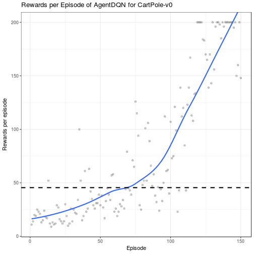

[](https://travis-ci.com/smilesun/rlR)
[](https://coveralls.io/github/smilesun/rlR?branch=master)
[](https://ci.appveyor.com/project/smilesun/rlr)


# rlR: Reinforcement learning in R

## Installation

```r
devtools::install_github("smilesun/rlR", dependencies = TRUE)
```

## Usage

```r
library(rlR)
showDefaultConf()
```

```
##                                         
## render                             FALSE
## log                                FALSE
## console                            FALSE
## agent.gamma                         0.99
## agent.flag.reset.net                TRUE
## agent.lr.decay         0.999000499833375
## agent.lr                           0.001
## agent.store.model                  FALSE
## policy.maxEpsilon                   0.01
## policy.minEpsilon                   0.01
## policy.decay                           1
## policy.softmax.magnify                 1
## replay.batchsize                      64
## replay.memname                   Uniform
## replay.mem.size                    20000
## replay.epochs                          1
## replay.freq                            1
```

```r
env = makeGymEnv("CartPole-v0")
listAvailAgent()
```

```
## [1] "AgentDQN:Deep Q learning"                                          
## [2] "AgentFDQN:Frozen Target Deep Q Learning"                           
## [3] "AgentDDQN: Double Deep QLearning"                                  
## [4] "AgentPG: Policy Gradient Monte Carlo"                              
## [5] "AgentPGBaseline: Policy Gradient with Baseline"                    
## [6] "AgentActorCritic: Actor Critic Method"                             
## [7] "AgentDDPG: Deep Deterministic Policy Gradient for Continous Action"
```


```r
conf = getDefaultConf("AgentDQN")
conf$set(render = FALSE, console = FALSE)
agent = makeAgent("AgentDQN", env, conf)
system.time({
 perf = agent$learn(150)
})
 perf$plot()
```
-```
-
-```
-##    user  system elapsed 
-## 632.296   5.828 631.660
-```
-
-```r
  perf$plot()
 ```
-
-```
-## `geom_smooth()` using method = 'loess'
-```
-
-
