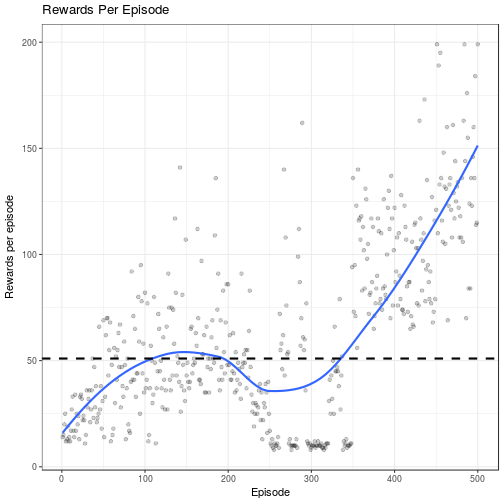

[](https://travis-ci.com/smilesun/rlR)
[](https://coveralls.io/github/smilesun/rlR?branch=master)
[](https://ci.appveyor.com/project/smilesun/rlr)

# rlR: Reinforcement learning in R

## Installation

```r
# devtools::install_github("smilesun/rlR", dependencies = TRUE)

```

## Usage

```r
library(rlR)
# installDep()   # this will run tensorflow::install_tensorflow() and keras::install_keras()
env = makeGymEnv("CartPole-v0")
listAvailAgent()
```

```
## [1] "AgentDQN:deep q learning"                      
## [2] "AgentFDQN:frozen target deep q learning"       
## [3] "AgentDDQN: double deep q learning"             
## [4] "AgentPG: policy gradient basic"                
## [5] "AgentPGBaseline: policy gradient with baseline"
## [6] "AgentActorCritic: actor critic method"
```


```r
agent = makeAgent("AgentActorCritic", env)
```

```
## parameters: 
## -render: - TRUE-
## -agent.gamma: - 0.99-
## -policy.maxEpsilon: - 1-
## -policy.minEpsilon: - 0-
## -policy.decay: - 0.994017964053935-
## -replay.memname: - Latest-
## -replay.epochs: - 1-
## -interact.maxiter: - 500-
## -log: - FALSE-
## -console: - TRUE-
## -policy.name: - EpsilonGreedy-
## -agent.nn.arch.actor: nhidden- 64-
##  -agent.nn.arch.actor: act1- tanh-
##  -agent.nn.arch.actor: act2- softmax-
##  -agent.nn.arch.actor: loss- categorical_crossentropy-
##  -agent.nn.arch.actor: lr- 1e-04-
##  -agent.nn.arch.actor: kernel_regularizer- regularizer_l2(l=0.0001)-
##  -agent.nn.arch.actor: bias_regularizer- regularizer_l2(l=1e-4)-
##  -agent.nn.arch.actor: decay- 0.9-
##  -agent.nn.arch.actor: clipnorm- 5-
## -agent.nn.arch.critic: nhidden- 64-
##  -agent.nn.arch.critic: act1- tanh-
##  -agent.nn.arch.critic: act2- linear-
##  -agent.nn.arch.critic: loss- mse-
##  -agent.nn.arch.critic: lr- 1e-04-
##  -agent.nn.arch.critic: kernel_regularizer- regularizer_l2(l=0.0001)-
##  -agent.nn.arch.critic: bias_regularizer- regularizer_l2(l=1e-4)-
##  -agent.nn.arch.critic: decay- 0.9-
##  -agent.nn.arch.critic: clipnorm- 5-
```

```r
agent$updatePara("console", FALSE)
system.time({
 perf = agent$learn(500)
})
```

```
##    user  system elapsed 
## 726.996  12.000 777.714
```

```r
 perf$plot()
```

```
## `geom_smooth()` using method = 'loess'
```


