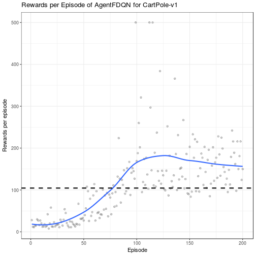

# Summary

Deep reinforcement learning has gained increased attention recently due to its sucess in solving
many complex scenarios including atari games, go and so on. Although there are many reinforcement learning code pieces or even libraries available online for sovling different problems, they are either focused on sovling a specific problem or writen in languages other than R. And there is indeed some light-weight R packages available[rMarkdown](https://arxiv.org/abs/1810.00240)  A multi-fledged R implementation which could handle different levels of scenario complexity is still lacking from the community. 

The package rlR aims at serving as a generic deep reinforcement learning solver where we expect the user create their customized environment or scenario as input. Several deep reinforcement learning algorithms are included and examples of how to use the library are well documented. The algorithms can be categrized into value based method and policy gradient methods.

# High lights

The package rlR is written in a Aspect Oriented Programming fashion which allows customized
operation during the interaction between the agent and the environment.

Most of the operations are configurable through a configuration object where the user could easily
query the  meaning of each configuration parameter.

The package is also designed in an Object oriented fashion which makes it easily extensible to new
algorihtms.

# Example

# Acknowledgements

We acknowledge contributions from Janek Thomas and support from DFG probject.

# References
